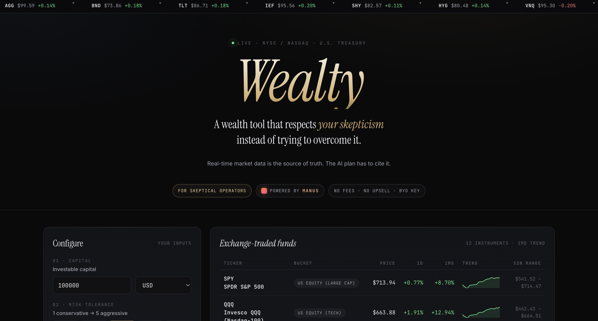

<div align="center">

# Wealty

**A wealth tool that respects your skepticism instead of trying to overcome it.**

Live market data is the source of truth. The AI plan has to cite it.

<sub>ETF & equity quotes via Yahoo Finance · U.S. Treasury yields via fiscaldata.treasury.gov · reasoning via [Manus](https://manus.im)</sub>

<br />



</div>

---

## The thesis

> Every wealth-tech product targets the same persona — *mass affluent, financially curious, default trusting* — and then spends product energy **overcoming** that persona's hesitations.
>
> Wealty targets the opposite: **skeptical, technical, default suspicious.** Engineers who watched FTX, who never trusted a "fiduciary," who can read a 10-K but won't open a brokerage app. There are hundreds of thousands of these people in tech with seven figures sitting in a HYSA — not because they don't know better, but because **no tool ever felt safe to use.**
>
> Most products try to overcome that instinct. We designed for it.

That single bet rewrites every product decision:

- **Source-of-truth tables aren't a feature. They're a respect signal.** This audience reads numbers, not narratives.
- **A visible prompt isn't a feature. It's a respect signal.** This audience trusts what they can audit.
- **Bring-your-own-key isn't a feature. It's a respect signal.** This audience knows hosted credentials are a liability.
- **One textarea — not a chat — isn't a constraint. It's a respect signal.** This audience can think clearly in writing; chat UIs are designed to make people stop thinking.

Trust, in this product, is not a UX layer painted on top with testimonials and badges. It's a **data-architecture choice**: live tables are the source of truth, the AI is a transformation on top of that data, and every step is inspectable. Trust becomes provable, not promised.

## What it actually does

One textarea. One prompt. One plan.

The user describes their situation in their own words — *"I have $400k cash, $600k in NVDA RSUs vesting over 3 years, married, want to FIRE at 50, paranoid about real-estate concentration, don't recommend crypto"* — and Wealty:

1. **Snapshots three live tables** (12 ETFs, 10 large-cap stocks, U.S. Treasury yields) and embeds the exact rows into the prompt.
2. **Sends that prompt to Manus**, with explicit instructions to (a) honor the user's narrative over the structured defaults, (b) cite the live data on every recommendation, (c) only use tickers from the on-screen universe, (d) call out anything in the user's story it picked up — quoted.
3. **Returns a Markdown plan** with: a Summary, an Allocation table that sums to 100% / total capital, a per-line Rationale citing the data, specific Risks, a Rebalancing rule, a Realism check, and a *"What we picked up from your story"* section quoting the user back to themselves.
4. **Renders the plan inline next to the source-of-truth tables**, so claim → evidence is one screen.
5. **Exposes the literal prompt** that was sent. Paste it into Claude or GPT-5, run it yourself, compare. That capability is a feature, not a leak.

| Surface | What it is | Why it's there |
| --- | --- | --- |
| Live ticker tape | Bloomberg-style auto-scroll across the top | Signals "this is real data, not a mock" before the user reads a single word |
| Source-of-truth tables | ETFs, stocks, Treasury yields with sparklines | The thing the AI must justify itself against |
| Compose textarea | One free-form input, not a chat | Forces honest thinking; preserves auditability |
| Override panel | Capital / risk / return / horizon, hidden by default | Defaults exist; the textarea is primary |
| AI plan panel | Markdown, full width, with `View raw prompt` toggle | The AI is a guest in the user's screen, not the host |

## Design principles

1. **Auditable, not authoritative.** The plan is a hypothesis the user grades against the tables next to it. We never say *"trust us."*
2. **Constrained AI.** Manus can only recommend tickers from the on-screen universe. No leverage, no shitcoins, no structured products. The blast radius of an AI hallucination is bounded by the table.
3. **No fee narrative.** No AUM, no premium tier, no managed accounts. The economics aren't aligned with selling you anything.
4. **One shot, not a chat.** Money decisions are infrequent. Chat UIs reward shallow, additive prompts; a textarea rewards thinking clearly once.
5. **Editorial, not enterprise.** Serif wordmark, gold-on-black, monospace numbers. It looks like a private bank's quarterly letter, not a SaaS landing page.

## Quickstart

```bash
git clone https://github.com/icecreamlun/Wealty.git
cd Wealty
npm install

# 1. get a Manus API key at https://manus.im
# 2. drop it in .env (gitignored)
cp .env.example .env
$EDITOR .env

node --env-file=.env server.js
# open http://localhost:3000
```

`MANUS_API_KEY` is **required** — the server refuses to start without it. No fallback key, no shared demo key, nothing baked in. Bring your own.

## Architecture

```
┌────────────────────────────┐         ┌──────────────────────────────┐
│  public/index.html         │         │  server.js (Express)         │
│  ─ source-of-truth tables  │ ──GET── │  /api/market                 │
│  ─ user inputs form        │         │    ├─ Yahoo Finance (12 ETF) │
│  ─ Markdown plan renderer  │         │    ├─ Yahoo Finance (10 stk)│
│  ─ "View raw prompt"       │ ──POST─ │  /api/plan                   │
│                            │         │    ├─ snapshot market data   │
└────────────────────────────┘         │    ├─ build constrained      │
                                       │    │   prompt                │
                                       │    ├─ POST Manus /v1/tasks   │
                                       │    └─ poll until completed   │
                                       └──────────────────────────────┘
```

## API reference

#### `GET /api/market`

Returns a snapshot of every table on the page.

```json
{
  "asOf": "2026-04-26T01:42:25Z",
  "etfs":   [{ "sym": "SPY", "price": 713.94, "dayChangePct": 0.77, "monthChangePct": 8.7, "...": "..." }],
  "stocks": [{ "sym": "AAPL", "...": "..." }],
  "treasury": {
    "asOf": "2026-03-31",
    "rows": [{ "security": "Treasury Bills", "ratePct": 3.702 }, "..."]
  }
}
```

#### `POST /api/plan`

Generates an allocation plan from current market data.

```bash
curl -X POST http://localhost:3000/api/plan \
  -H "Content-Type: application/json" \
  -d '{
    "capital": 100000,
    "currency": "USD",
    "risk": 3,
    "expectedReturn": 8,
    "horizonYears": 10
  }'
```

Response includes the assistant's Markdown text, the Manus `task_url` (so you can audit the run), and **the full prompt that was sent** — because if we won't show our work, why should you trust the answer?

## Manus integration notes

For anyone else integrating Manus, here's what we learned the hard way:

| | |
| --- | --- |
| Base URL  | `https://api.manus.im/v1` |
| Auth header | `x-manus-api-key: <key>` *(not `Authorization: Bearer`, which is JWT-only)* |
| Create task | `POST /v1/tasks` body `{"prompt": "..."}` → `{ task_id, task_url }` |
| Poll | `GET /v1/tasks/{id}` until `status === "completed"` |
| Read output | last item in `output[]` where `role === "assistant"`, then `content[0].text` |
| Latency | ~30–90s per task |

## Data sources

| What | Endpoint | Auth |
| --- | --- | --- |
| ETF / stock quotes | `query1.finance.yahoo.com/v8/finance/chart/{symbol}` | none |
| Treasury avg interest rates | `api.fiscaldata.treasury.gov/services/api/fiscal_service/v2/accounting/od/avg_interest_rates` | none |
| AI reasoning | `api.manus.im/v1/tasks` | `x-manus-api-key` |

## Roadmap

- **Plaid read-only integration** — so the plan accounts for your actual current holdings (especially the RSU concentration)
- **Per-bank deposit & CD rate feed** — FRED + an FDIC adapter, so "you're earning 0.01% in Chase, the market pays 4.2%" becomes a one-line callout
- **Tax-lot aware rebalancing** for taxable accounts
- **Diff view** — "here's what changed in your plan this week, and which underlying number drove it"
- **FX-aware allocations** for non-USD users

## Project layout

```
Wealty/
├─ server.js              # Express server: market data + Manus proxy
├─ public/
│  └─ index.html          # single-file frontend (no build step)
├─ package.json
└─ README.md
```

## License

MIT.

<div align="center">
<sub>Built for engineers who read 10-Ks for fun.</sub>
</div>
